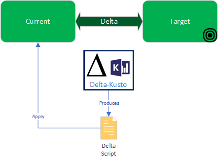

 

# Delta-Kusto

Delta-Kusto is a Command-line interface (CLI) enabling Continuous Integration / Continuous Deployment (CI / CD) automation with Kusto objects (e.g. tables, functions, policies, security roles, etc.) in [Azure Data Explorer](https://docs.microsoft.com/en-us/azure/data-explorer/data-explorer-overview) (ADX) databases.  It can work on a single database, multiple databases, or an entire cluster.  It also supports *multi-tenant* scenarios.

Delta-Kusto is doing what [SQL Database projects](https://docs.microsoft.com/en-us/sql/ssdt/project-oriented-offline-database-development) do for Microsoft SQL:  enabling CI/CD, change management and source control of Kusto databases.  It works with and produces Kusto scripts so it doesn't require a new language / serialization format and can therefore be used with other tools of the ADX ecosystem.

Delta-Kusto runs on Linux, Mac OS & Windows as a stand-alone executable.  It is meant to be used in *headless* mode.

Delta-Kusto works on database structure, **not data**:

* Functions
* Tables / Columns
* Ingestion Mapping
* Policies
* Materialized Views
* Security roles
* External tables
* Continuous Export

## Documentations

See the [documentation](documentation/README.md) for details and [tutorial section](documentation/README.md#tutorials) for different tutorials on Delta-Kusto.

## Overview

The high-level view of delta-kusto is the following:

The green boxes (*current* and *target*) represent [sources](documentation/sources.md).  A source can be:

* ADX Database
* Kusto script

Delta-Kusto computes the *delta* between the two sources.  The *delta* is a Kusto script containing the kusto commands required to take the *current* source and bring it to *target* source.   The *delta script* can be exported as a stand alone file or as a folder hierarchy of scripts for easier readability and git-diff.  It can also be applied to the *current* ADX Database.

Human validation often are required, especially if `.drop` commands are issued (to prevent unwanted data lost).

## Scenarios / Flows

Using different combinations of sources can enable different scenarios:

Current|Target|Scenario|Description
-|-|-|-
ADX Database|Kusto scripts|CI / CD scenario|Push the state if a script set to an ADX database.
Kusto scripts|ADX Database|Determine gap between a script set and existing DB|Computed Delta script shows what would need to be added to the script set to obtain the state of the target database.
Empty|ADX Database|Reverse engineer a database|Special case of the previous scenario.  The *delta* becomes the entire state of the *target*.
Kusto scripts|Kusto scripts|Offline sync|Compute a delta between two script sets.  No live databases needed.
ADX Database|Kusto scripts|Live Sync|Find gap between two databases.

## Limitations

The [current release](https://github.com/microsoft/delta-kusto/releases) of Delta-Kusto includes *functions*, *tables*, *ingestion mappings* & the following *policies*:

* Auto Delete
* Caching
* Ingestion Batching
* Merge
* Retention
* Sharding
* Update

See the [list of issues](https://github.com/microsoft/delta-kusto/issues/) for details on upcoming features and bugs found.

## Alternatives

* [Sync Kusto](https://github.com/microsoft/synckusto) - The Sync Kusto tool was built to help create a maintainable development process around Kusto.
* [Azure DevOps Task for Azure Data Explorer](https://docs.microsoft.com/en-us/azure/data-explorer/devops) - Azure Pipelines task that enables you to create release pipelines and deploy your database changes to your Azure Data Explorer databases.
