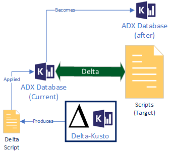
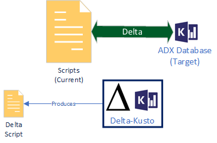
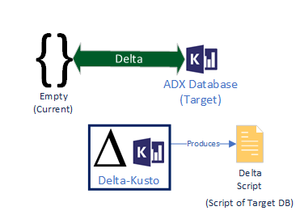

 

# Delta-Kusto

Delta-Kusto is a Command-line interface (CLI) enabling Continuous Integration / Continuous Deployment (CI / CD) automation with Kusto objects (e.g. tables, functions, policies, security roles, etc.) in [Azure Data Explorer](https://docs.microsoft.com/en-us/azure/data-explorer/data-explorer-overview) (ADX) databases.  It can work on a single database, multiple databases, or an entire cluster.  It also supports *multi-tenant* scenarios.

Delta-Kusto is doing what [SQL Database projects](https://docs.microsoft.com/en-us/sql/ssdt/project-oriented-offline-database-development) do for Microsoft SQL:  enabling CI/CD, change management and source control of Kusto databases.  It works with and produces Kusto scripts so it doesn't require a new language / serialization format and can therefore be used with other tools of the ADX ecosystem.

Delta-Kusto runs on both Linux & Windows as a stand-alone executable.  It is meant to be used in *headless* mode.

Delta-Kusto works on database structure, **not data**:

* Functions
* Tables / Columns
* Ingestion Mapping
* Policies
* Materialized Views
* Security roles
* External tables
* Continuous Export

## Documentations

See the [documentation](documentation/README.md) for details and [tutorial section](documentation/tutorials/README.md) for different tutorials on Delta-Kusto.

## Overview

The high-level view of delta-kusto is the following:

The green boxes (*current* and *target*) represent [sources](documentation/sources.md).  A source can be:

* ADX Database
* Kusto scripts (stand alone script file or a hierarchy of folders containing Kusto script files)

Delta-Script computes the *delta* between the two sources.  The *delta* can be represented as a Kusto script containing the kusto commands required to run on the *current source* so it would be identical to *target source*.   The delta script can be exported as a stand alone file or as a folder hierarchy of scripts for easier readability and git-diff.

This *delta script* can either be applied directly to an ADX Database or saved as a Kusto script for human validation.  Human validation often are required, especially if `.drop` commands are issued (to prevent unwanted data lost).

Using different combinations of sources can enable different scenarios as we explore in the next sub sections.

### 1. ADX Database (current) to Kusto scripts (target)

Typical CI / CD scenario:  take an ADX database and bring its content to the state of a target set of scripts.

Delta Kusto can generate a delta script with the minimal command set to bring the database to the *state* of the target script.  For instance, if a table is missing in the database, the delta script will contain the corresponding `.create table` command.

### 2. Kusto scripts (current) to ADX Database (target)

Here we reverse the roles from the previous scenario.

The *current* script could represent the last state of a production database and the *target* database could be the dev database.  The delta script will show the changes done in the dev environment.

This scenario is useful to reverse engineer changes done *manually* to an environment.

### 3. Empty (current) to ADX Database (target)

This is a special case of the previous scenario where the current script is empty or omitted.  Indeed, the *current* source is optional (target is mandatory).

The delta script becomes a complete script of the target database.

### 4. Kusto scripts (current) to Kusto scripts (target)

This is the *offline sync* scenario:  we take 2 set of scripts and generate the delta between them.

For instance, the *current* scripts could represent the state of a database while the target scripts could represent the desired state for that database.  The delta script is computed *offline* in the sense that no *real* ADX database is involved.

This scenario can be useful in highly controlled environment where the delta can be generated without access to the database.

### 5. ADX Database (current) to ADX Database (target)

This is the *Live Sync* scenario:  we want to bring an ADX database to the same state than another one.

## Limitations

The [current release](https://github.com/microsoft/delta-kusto/releases) of Delta-Kusto focusses on *functions*.

[Tables are planned](https://github.com/microsoft/delta-kusto/issues/8) for the next release.

See the [list of issues](https://github.com/microsoft/delta-kusto/issues/) for details on upcoming features and bugs found.

## Alternatives

* [Sync Kusto](https://github.com/microsoft/synckusto) - The Sync Kusto tool was built to help create a maintainable development process around Kusto.
* [Azure DevOps Task for Azure Data Explorer](https://docs.microsoft.com/en-us/azure/data-explorer/devops) - Azure Pipelines task that enables you to create release pipelines and deploy your database changes to your Azure Data Explorer databases.
