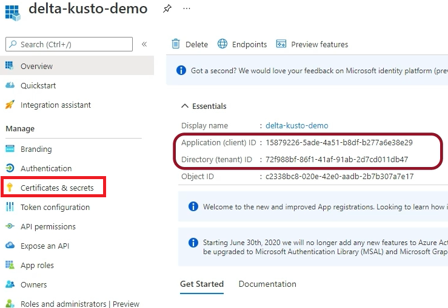
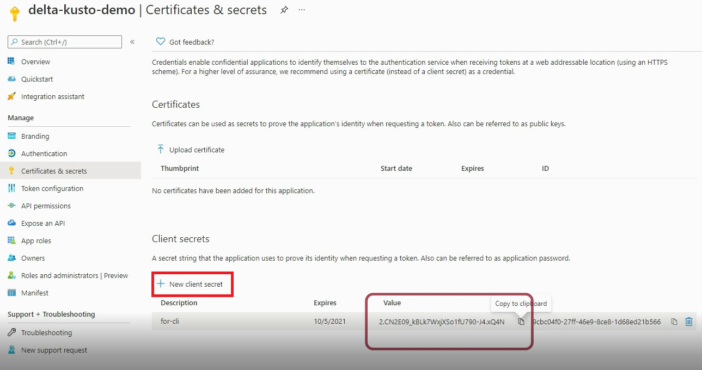
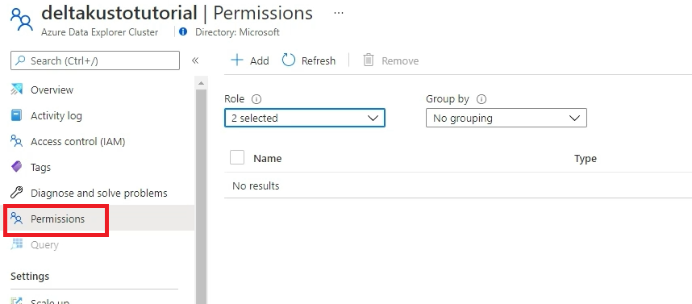
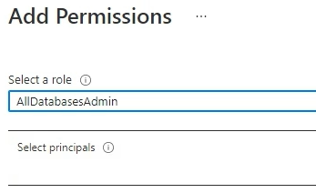
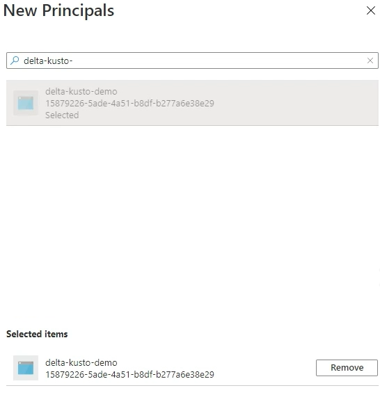
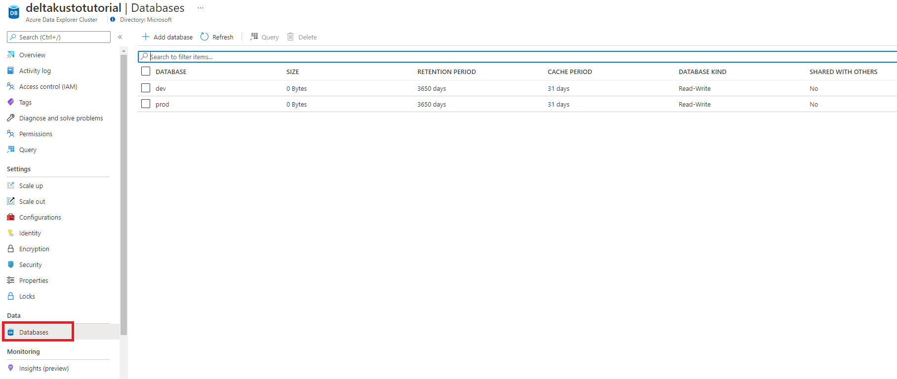
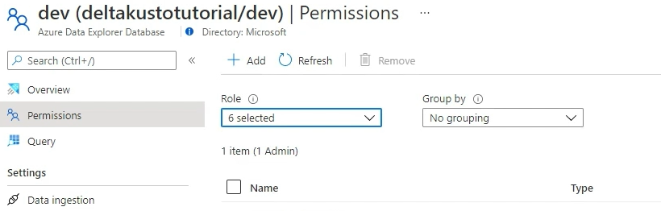

# Authentication Tutorial

This tutorial explains how the Delta Kusto CLI can authenticate against an Azure Data Explorer (ADX) cluster.

This tutorial is also [available as a YouTube video](https://www.youtube.com/watch?v=ErLSCKCkGXI).

The [parameter file](../../parameter-file.md) shows 2 methods to authenticate in the `tokenProvider` section:

```yaml
tokenProvider:
    tokens:
        myToken:
            clusterUri:  "string"
            token:  "string"
    login:
        tenantId:  "string"
        clientId:  "string"
        secret:  "string"
```

The first one, `tokens`, consists in providing an actual oauth token for each ADX cluster URI used in the parameter file.

The second method, `login`, consists in providing login information of an Azure AD Service Principal.  **This is the method we are going to explore in this article**.

There is a third method [not implemented yet](https://github.com/microsoft/delta-kusto/issues/7) which would use a [Managed Service Principal](https://www.youtube.com/watch?v=TK8jdVpWsNY) (MSI).  This would allow to run Delta Kusto without sharing Service Principal credentials. It would require Delta Kusto to run in a compute having MSI enabled.

## Creating a Service Principal

Here we are going to create a Service Principal.  If we would plan to reuse an existing Service Principal, we would obviously skip this step.

We are going to show how to do this using the Azure Portal.  [This can also be done using the Azure CLI](https://docs.microsoft.com/en-us/azure/developer/python/how-to-manage-service-principals#manage-service-principals-using-the-azure-cli).

In the Azure Portal, we are going to open the Azure Active Directory (AAD) resource and select *App registrations*:


We then click on *New registration*.  Here we need to give a name and click *Register*.  We called ours *delta-kusto-demo*.  This name is for human readability only, i.e. to easily find the service principal in a list.

We already have two of the three information we required:  the application ID (also called client ID) and the tenant ID.



We now need to create a secret for authentication purposes.  So we click on *Certificates & secrets*.

On the *Certificates & secrets* pane, we click on *New client Secret* under *Client Secrets*.

We type a *description* (we choose *for-cli*) and an expiry date.  We can then click *Add*.

After a few seconds, the secret is created and we can copy its *value*.



We now have the three information we needed:

*   tenantId
*   clientId
*   secret

## Giving Service Principal Permissions

Now that we have a Service Principal that Delta Kusto can authenticate with, we need to allow this Service Principal to access our ADX clusters.

The simplest way is to give access at the cluster level ([next sub section](#giving-permission-at-cluster-level)).  A more fine grain approach is to give access at the database level ([sub section after the next one](#giving-permission-at-database-level)).

### Giving permission at Cluster Level

For cluster-level permission, we need to select the *Permissions* tab in the ADX Cluster resource:



#### Adding permission

We then click *Add*.  We are then invited to select a role from:

* *AllDatabasesAdmin*
* *AllDatabasesViewer*

We should select *AllDatabasesAdmin* if we want Delta Kusto to *write* on the cluster, e.g. create / drop policies.  We should select *AllDatabasesViewer* if we only want Delta Kusto to *read*, e.g. read all policies.



From there we click *Select principals*.

We can start typing the name of the service principal we created and it should appear in the list below.  We can then select it and click *Select*.



Back to the *Add Permissions* screen we can hit *Save*.  This will persist the permissions on the cluster.

### Giving permission at Database Level

For database-level permission, we essentially need to perform the same task but first selecting a database:



We then select the *Permissions* tab.



From there we proceed to [add a permission](#adding-permission) as we did in the last section.

## Summary

We have created a service principal.

We have the three key information about that service principal (tenantId, clientId & secret) which we can provide to Delta Kusto to authenticate.

We also gave permission to the service principal to access different ADX cluster.

We are now ready to use this service principal.  See [the Delta Kusto overview tutorial](../overview-tutorial/README.md) for examples.