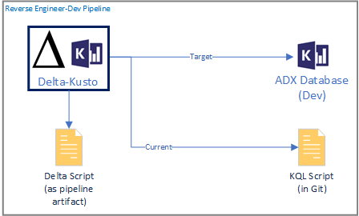
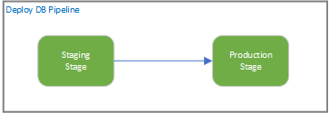
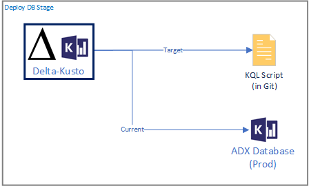

# Using Delta Kusto in Azure DevOps

This article shows how to use [Delta Kusto](https://github.com/microsoft/delta-kusto) in an [Azure DevOps YAML Pipeline](https://docs.microsoft.com/en-us/azure/devops/pipelines/yaml-schema).

## Scenarios

We are going to look at two different scenarios quite typical in CI / CD processes.

### Reverse Engineer

### Deploy DB

## Results

## Pipelines explained

## Summary