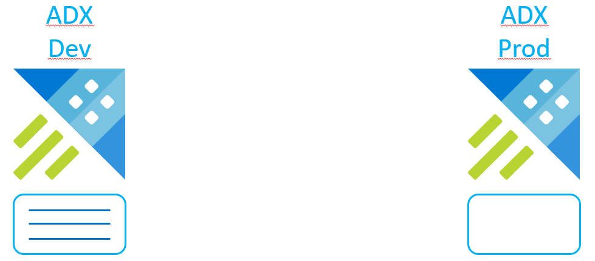
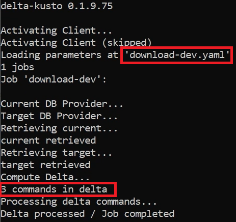
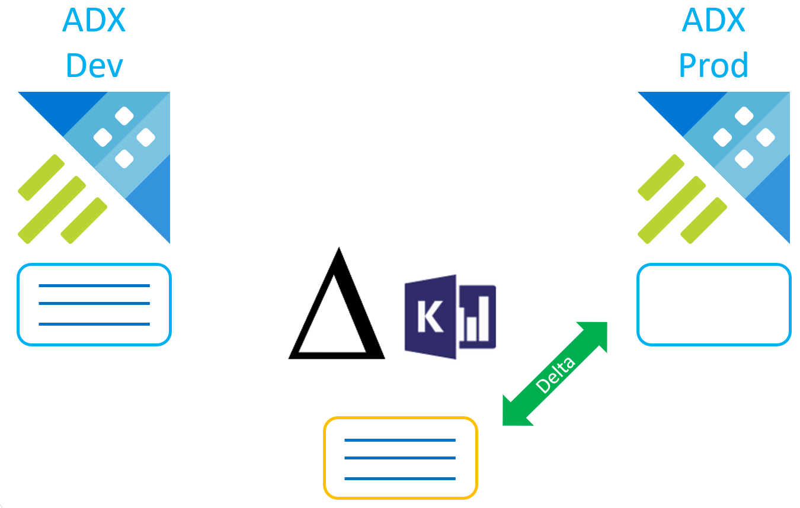
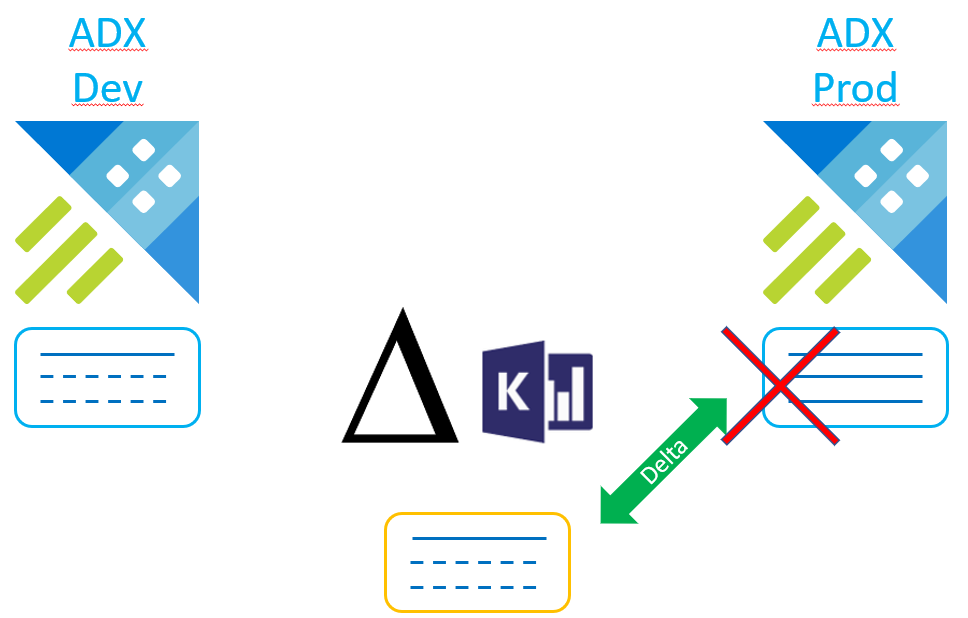
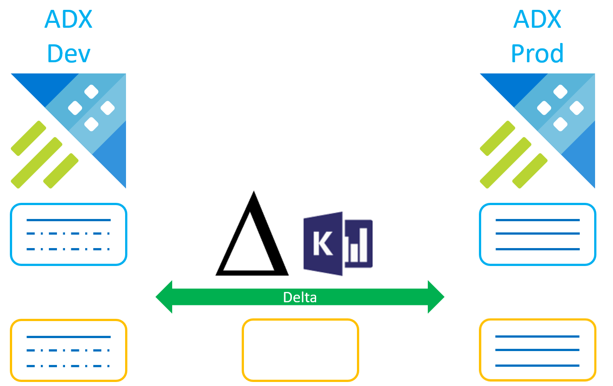

# Delta Kusto Overview Tutorial

In this tutorial, we are going to use the Delta Kusto CLI and tour its functionalities.

We are going to cover a few scenarios.  Because of this breath we won't cover details such as how to download Delta Kusto or authentication to ADX Clusters.  We suggest looking at [other tutorials](../README.md) for more details.  Specifically, [Delta Kusto Download / Install](../install/README.md) and [Authenticating to ADX Clusters](../authentication/README.md) would be useful.

This tutorial is also [available as a YouTube video](https://www.youtube.com/watch?v=2neGBKlcoOA).

## Delta Kusto

As explained in the [main documentation](https://github.com/microsoft/delta-kusto):

>>> Delta-Kusto is a Command-line interface (CLI) enabling Continuous Integration / Continuous Deployment (CI / CD) automation with Kusto objects (e.g. tables, functions, policies, security roles, etc.) in Azure Data Explorer (ADX) databases. It can work on a single database, multiple databases, or an entire cluster. It also supports multi-tenant scenarios.

Delta Kusto comes as a single-file executable available on both Windows and Linux distributed as a [GitHub release](https://github.com/microsoft/delta-kusto/releases).

The CLI accepts the path to a [parameter file](../../parameter-file.md).  The parameter file is a YAML file instructing Delta Kusto on what job to perform.

A single call to Delta Kusto can run multiple jobs.  This feature enables change management on multi-tenant solutions within Azure Data Explorer.  In this tutorial we'll only run one job at the time.

A job consists of a current and target *sources*.  Sources can either be a script (or set of scripts) or an ADX Database.  Delta Kusto can therefore compute the delta between 2 ADX Databases, between a script and an ADX Database or between 2 scripts (offline mode).

A job also defines actions.  An action specifies where to push the delta:  on the console, on files or on the current source (if the current source is an ADX Database).

This simple configuration enables multiple scenarios as we'll see in this tutorial.

The parameter file also defines a way for Delta Kusto to authenticate against ADX clusters via a Service Principal (see [Authenticating to ADX Clusters tutorial](../authentication/README.md) for details).

The parameter file is meant to be persisted in source control.  For that reason, we do not want to put sensitive information such as credentials.  We can override parameter file values with parameters to the CLI to avoid relying on the file containing sensitive data.  Overriding values can also be useful to re-use the same parameter file in different environments (e.g. by overriding the cluster URIs / database name).

In this tutorial, we are going to use only one cluster, but Delta Kusto can compute delta between multiple clusters.

## How Delta Kusto works

One of the strength of Delta Kusto is that it parses scripts and / or load database configuration into a database *model*.  It can then compare two models to compute a Delta.

This approach might seem overkilled when considering functions for instance where a simple `create-or-alter` can overwrite a function.  It does offer some advantages though:

1. Computes a minimalistic set of delta commands since it doesn't need to `create-or-alter` everything *just in case*
1. Detects drops (e.g. table columns) and can treat them as such
1. Can do *offline delta*, i.e. compare two scripts without any Kusto runtime involved.

## Scenarios

All scenarios we are going to cover are based on the following setup:  a dev database and a prod database.



Those databases represent the same database in 2 different environments.  We'll use the same cluster, but they could be on different ADX clusters.

All scenarios we'll look at will involve change management between those two environments.

## Original development

To simulate development happening before the introduction of Delta Kusto, we'll run the scripts from [dev-start-samples.kql](dev-start-samples.kql) on the *dev* database:

```kusto
.create-or-alter function with (docstring = "A list of interesting states",folder = "Helpers") InterestingStates {
    dynamic(["WASHINGTON", "FLORIDA", "GEORGIA", "NEW YORK"])
}

.create-or-alter function  Add(a:real,b:real) {a+b}

.create-or-alter function with (docstring = "Direct table access example") DirectTableAccess(myTable:(*)) {
    myTable | count
}
```

This creates 3 functions.  The top one is in a folder named *Helpers*.

## Download Dev

We now want to introduce change management so the first thing we want to do is to put our *dev* database under source control.

For that we're going to use Delta Kusto to *download* the database's structure.

There is no *download* functionality in Delta Kusto but we can trick it into one by have an empty *current* database.  This is the default when the current source isn't specified, it is assumed to be empty.

We'll use the Parameter file from [download-dev.yaml](download-dev.yaml):

```yaml
sendErrorOptIn:  true
jobs:
  download-dev:
    target:
        adx:
            clusterUri:  to-be-overriden
            database:  dev
    action:
        filePath:  dev-state.kql
tokenProvider:
    login:
        tenantId:  to-be-overriden
        clientId:  to-be-overriden
        secret:  to-be-overriden
```

The first YAML property is `sendErrorOptIn`.  By default, this is false.  When set to `true`, if any error occurs during the CLI execution, the content of the error (i.e. the stack trace, exception type & exception message) are going to be sent to a central API for analysis.  Setting this option to `true` basically help pro-actively improve Delta Kusto.  It does send some data to a central (private) API though.

We see that we define one job with an empty current source (i.e. unspecified), an ADX target database *dev* and an action to push the delta to a KQL file.

In order to execute this job, we would need to run the CLI:

```
delta-kusto -p download-dev.yaml 
```

Now if we do that, there are several values in the YAML that are specified as *to-be-overriden* that will cause problem.  For that reason, we need to override those values:

```
delta-kusto -p download-dev.yaml -o tokenProvider.login.tenantId=$tenantId tokenProvider.login.clientId=$clientId tokenProvider.login.secret=$secret jobs.download-dev.target.adx.clusterUri=$clusterUri
```

(Assuming we've set the variables `$tenantId`, `$clientId`, `$secret` and `$clusterUri` to relevant values)

The override mechanism is quite simple:  for each override we specified the path to the property, e.g. `tokenProvider.login.tenantId`, then `=` and the value.

Executing this CLI command should start Delta Kusto and give an output similar to:



We see different steps of the run and the fact that 3 commands were found in the delta.

Looking at the generated script, i.e. `dev-state.kql`:

```kusto
//  Create functions

.create-or-alter function with (skipvalidation="True") Add (['a']:real, ['b']:real) {
a+b
}

.create-or-alter function with (docstring="Direct table access example", skipvalidation="True") DirectTableAccess (['myTable']:(*)) {
myTable | count
}

.create-or-alter function with (folder="Helpers", docstring="A list of interesting states", skipvalidation="True") InterestingStates () {
dynamic(["WASHINGTON", "FLORIDA", "GEORGIA", "NEW YORK"])
}
```

We see that this script is similar to the script we used to populate the database (and is actually functionally equivalent) but not identical.  This is because the database configuration was loaded into a database model before being re-rendered into scripts.

##  Push dev script to prod

Now that we have a script representing the *dev* database state, we can push that state to the *prod* database:



This time we invert the sources.  The current will be an ADX Database (*prod*) while the target will be a script.  We use [push-to-prod.yaml](push-to-prod.yaml) as parameter file:

```yaml
sendErrorOptIn:  true
failIfDrops:  true
jobs:
  push-script-to-prod:
    current:
      adx:
          clusterUri:  to-be-overriden
          database:  prod
    target:
      scripts:
        - filePath:  dev-state.kql
    action:
        filePath:  prod-update.kql
        pushToCurrent:  true
tokenProvider:
    login:
        tenantId:  to-be-overriden
        clientId:  to-be-overriden
        secret:  to-be-overriden
```

We notice a new property:  `failIfDrops`.  It won't get into play in this scenario but will in a later one.

We see that we define two actions:

1. Pushing the delta to a file
1. Pushing the delta to the current ADX database

We can run the CLI in a similar way than previously.

We can now see that the *prod* database has the same configuration as the *dev* one.  The delta script was a little trivial since *prod* was empty, it was simply the entire *dev* state.

##  Download a modified *dev*

Let's simulate that development continues by doing some modification to the *dev* database.  We use [modify-dev.kql](modify-dev.kql) for that:

```kusto
//  Change the folder of 'InterestingStates'
.create-or-alter function with (docstring = "A list of interesting states",folder = "states") InterestingStates {
    dynamic(["WASHINGTON", "FLORIDA", "GEORGIA", "NEW YORK"])
}

//  Drop function 'Add'
.drop function Add

//  Create a new function
.create-or-alter function Substract(a:real,b:real) {a-b}
```

We can reuse [download-dev.yaml](download-dev.yaml) to download the state of the *dev* database again.  Since this perform a delta against an empty *current*, it downloads the full state of the database.

**This is what we want**.  Delta Kusto works with target state configuration.  Whatever the state of *prod* the end state is going to be the state of the *dev* database.

##  Push those modifications to *prod*

We can reuse [push-to-prod.yaml](push-to-prod.yaml) as a parameter file to push the *dev* state to prod.

Doing that we should expect a failure though.



This is because of the `failIfDrops` property we mentioned.  This flag is there to protect against `.drop` commands.  In this case the delta would need to drop the `Add` function.

We use that flag if we want to enforce a human approbation in a CI/CD pipeline when `.drop` occurs.

We could force the delta to occur by either changing the file or overriding the `failIfDrops` property value.

##  Push *prod* back to dev (Sync)

Now instead of forcing the delta to *prod*, let's go to another common scenario:  bringing back the *prod* in *dev*.

This is a typical scenario when we suspect the *prod* (the truth) has drifted away from our *dev* database.

Here we're going to do that directly from database to database without intermediary scripts, using [prod-to-dev.yaml](prod-to-dev.yaml) as parameter file:

```
sendErrorOptIn:  true
failIfDrops:  false
jobs:
  prod-to-dev-sync:
    current:
      adx:
          clusterUri:  to-be-overriden
          database:  dev
    target:
      adx:
          clusterUri:  to-be-overriden
          database:  prod
    action:
        filePath:  dev-update.kql
        pushToCurrent:  true
tokenProvider:
    login:
        tenantId:  to-be-overriden
        clientId:  to-be-overriden
        secret:  to-be-overriden
```

This is essentially a *sync* and is typically done as a one-off, outside of CI/CD automation.

## Controlled environment and offline delta

Let's consider a more advanced scenario in a controlled environment.

Let's assume the change management process involve not touching the ADX databases directly.  This is typical in environment where permissions are given to users with different roles.  For instance, user X can retrieve the state of the databases to user Y who could validate the delta.



This is what we call an *offline delta* because the delta is computed without any ADX cluster involved.

Let's look at the parameter file [offline-delta.yaml](offline-delta.yaml):

```yaml
sendErrorOptIn:  true
jobs:
  offline-delta:
    current:
      scripts:
        - filePath:  prod-state.kql
    target:
      scripts:
        - filePath:  dev-state.kql
    action:
        filePath:  prod-update.kql
```

Interestingly, this file doesn't need authentication information since it is offline.  The CLI command will also be much simpler since we do not need to override anything:

```
delta-kusto -p offline-delta.yaml
```

This scenario is a bit rarer but isn't more complicated to accomplish with Delta Kusto.

## Summary

We've looked at common change management and CI / CD scenarios and how they can be performed using Delta Kusto.

We suggest trying some of those scenarios on existing databases to get familiar with the tool.